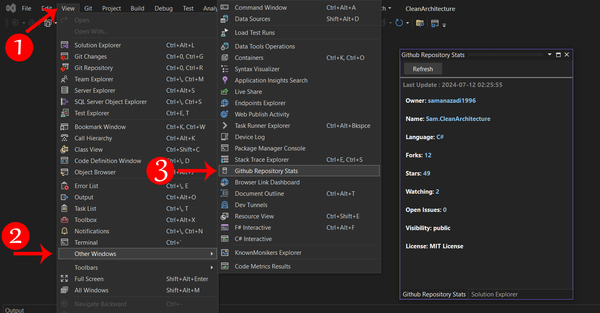

# Installation, Execution, and Usage of the "GithubRepositoryStats" Visual Studio Extension

## Introduction
The "GithubRepositoryStats" extension for Visual Studio helps developers easily view information about their GitHub repositories directly within the Visual Studio environment. This extension provides details such as the number of stars, forks, programming language, and open issues. In this article, we will explain how to install, run, and use this extension, and discuss the benefits of using it.

### Installing the Extension

1. Download and Install Visual Studio: First, ensure that Visual Studio is installed on your system. If not, you can download and install the appropriate version of Visual Studio from the official Microsoft website.

2. Download the "GithubRepositoryStats" Extension: Go to the Visual Studio Marketplace and search for the "GithubRepositoryStats" extension. Download and install the extension.

3. Manual Installation of the Extension: If you have downloaded the extension from other sources, you can manually install it. Download the VSIX file for the extension and double-click on it to start the installation process.

### Running and Using the Extension

1. Open Visual Studio: Launch Visual Studio and load a project that is connected to a GitHub repository.

2. Open the Extension Tool Window: From the "View" menu, go to "Other Windows" and select "GithubRepositoryStats." The extension tool window will open. `View >> Other Windows >>  Github Repository Stats`

3. Refreshing Repository Information: In the tool window, click the "Refresh" button to update the information for your GitHub repository. The extension will automatically connect to the repository, fetch the relevant information from GitHub, and display it.

    

### Benefits of Using the "GithubRepositoryStats" Extension

1. Quick Access to Repository Information: With this extension, you can quickly and easily view information about your GitHub repositories without leaving the Visual Studio environment.

2. Increased Productivity: This extension helps developers access key repository information without needing to visit the GitHub website, thus enhancing productivity.

3. Simple and Efficient: The "GithubRepositoryStats" extension features a simple and user-friendly interface that makes it easy for developers to use.

4. Improved Project Management: Access to critical repository information allows you to better manage your projects and make more informed decisions regarding the development and maintenance of your code.

5. Support for Multiple Repositories: This extension allows you to view information for multiple GitHub repositories, enabling you to see details for all your projects in one place.

## Conclusion
The "GithubRepositoryStats" extension is a valuable tool for Visual Studio developers, enabling them to easily view information about their GitHub repositories. By installing and using this extension, you can increase your productivity and better manage your projects. With its simple and efficient user interface, this tool will enhance your development experience.

